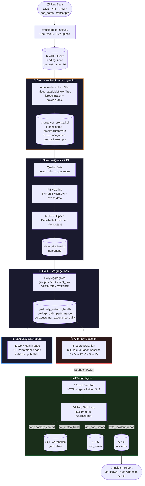

# Azure Telecom Data Lake + AI Triage Agent

<div align="center">

| 📦 Data Volume | 🥇 Medallion Layers | 🤖 AI Agent | 🚀 Deployment |
|:---:|:---:|:---:|:---:|
| **~55K CDRs · 5K KPIs · 70 txt files** | **Bronze → Silver → Gold** | **GPT-4o · 4 tools · max 10 turns** | **Azure Databricks · Azure Functions** |

</div>

A production-style telecom data lake built on **Azure Databricks** with the Medallion Architecture, an automated **Z-score anomaly detection** alert, and an **Azure OpenAI GPT-4o** agentic triage system that autonomously investigates network anomalies and writes structured incident reports — all wired together end-to-end.

---

## What It Does

When a cell tower shows unusual CDR null-rate patterns, the system:

1. **Detects** the anomaly using a Z-score SQL query on the Gold layer (Z ≥ 5 → P1)
2. **Fires** a Databricks SQL Alert webhook to an Azure Function
3. **Runs** a GPT-4o tool-calling loop that queries live Gold tables, reads NOC history, and reasons about root cause
4. **Writes** a structured Markdown incident report directly to ADLS

Mean time from anomaly to written report: **under 60 seconds**.

---

## Architecture



---

## Azure Infrastructure

```
  S-Drive raw data (CDR parquet, KPI json, NOC txt)
       │
       │  scripts/upload_to_adls.py  (run once)
       ▼
  ┌─────────────────────────────────────────────────┐
  │  ADLS Gen2  ·  adlstelecom<your-account>        │
  │  Container: telecom                             │
  │                                                 │
  │  landing/cdr/         ← parquet (50K rows)      │
  │  landing/kpi/         ← json   (5K rows)        │
  │  landing/snmp/        ← json                    │
  │  landing/customers/   ← parquet                 │
  │  landing/noc_notes/   ← txt    (20 files)       │
  │  landing/transcripts/ ← txt    (50 files)       │
  │  landing/incidents/   ← AI-written reports      │
  └───────────────────────┬─────────────────────────┘
                          │  AutoLoader (cloudFiles)
                          ▼
  ┌─────────────────────────────────────────────────┐
  │  Azure Databricks  ·  Premium tier              │
  │  Unity Catalog: telecon_dev                     │
  │                                                 │
  │  ┌─────────────┐  ┌─────────────┐              │
  │  │   Bronze    │  │   Silver    │              │
  │  │  6 tables   │─►│  2 tables   │              │
  │  │ Delta/ADLS  │  │ MERGE upsert│              │
  │  └─────────────┘  └──────┬──────┘              │
  │                          │                      │
  │                   ┌──────▼──────┐              │
  │                   │    Gold     │              │
  │                   │  3 tables   │              │
  │                   │ OPTIMIZE    │              │
  │                   │ + ZORDER    │              │
  │                   └──────┬──────┘              │
  │                          │                      │
  │  ┌───────────────────────▼───────────────────┐  │
  │  │  Databricks SQL Warehouse (Serverless)    │  │
  │  │  Z-score Alert → fires when P1 count > 0 │  │
  │  │  Lakeview AI/BI Dashboard (7 charts)      │  │
  │  └───────────────────────┬───────────────────┘  │
  └──────────────────────────┼──────────────────────┘
                             │  webhook POST
                             ▼
  ┌─────────────────────────────────────────────────┐
  │  Azure Function App  ·  func-triage-agent       │
  │  Linux · Python 3.11 · Consumption plan         │
  │                                                 │
  │  POST /api/triage                               │
  │       │                                         │
  │       ▼                                         │
  │  agent_runner.py  ─► GPT-4o tool-calling loop   │
  │       │                                         │
  │       ├─► get_anomaly_context  ──► SQL Warehouse │
  │       ├─► get_metric_trend     ──► SQL Warehouse │
  │       ├─► get_noc_history      ──► ADLS txt      │
  │       └─► write_incident_report ─► ADLS md       │
  └─────────────────────────────────────────────────┘
                             │
                             ▼
              Azure OpenAI  (GPT-4o · gpt-4o-mini)
              api_version: 2024-12-01-preview
```

---

## How It Works

### Pipeline (Bronze → Silver → Gold)

1. **Upload** — `scripts/upload_to_adls.py` pushes all raw files from local S-Drive into the ADLS `landing/` zone once. Never re-runs.
2. **Bronze** — 6 AutoLoader notebooks ingest each source format (Parquet, JSON, binaryFile for .txt). Each uses `trigger(availableNow=True)` + `foreachBatch` so streaming writes can call `saveAsTable()`. Checkpoints live in UC Volumes.
3. **Silver** — Quality gate rejects rows missing mandatory fields (quarantined to `silver.quarantine`). MSISDN columns are SHA-256 masked with a daily salt. MERGE upsert via `DeltaTable.forName()` makes re-runs safe.
4. **Gold** — Three aggregation tables materialise daily metrics per cell. `OPTIMIZE ... ZORDER BY (cell_id)` runs after every write for fast point lookups by the AI agent.

### Anomaly Detection

5. **SQL Alert** — A saved Z-score query on `gold.daily_network_health` runs daily. The alert fires when `p1_count > 0` (cells where null-rate Z-score ≥ 5 today vs. 30-day rolling baseline).
6. **Webhook** — The alert POSTs the anomaly payload to the Azure Function via a Databricks Jobs API destination.

### AI Triage Agent

7. **Azure Function** (`POST /api/triage`) receives the anomaly JSON and calls `run_agent()`.
8. **GPT-4o loop** — The agent follows a fixed investigation protocol:
   - `get_anomaly_context` — queries current metrics for the flagged cell
   - `get_metric_trend` — retrieves 5-day history from both Gold tables
   - `get_noc_history` — keyword searches past NOC engineer notes in ADLS
   - `write_incident_report` — writes a structured Markdown report with root cause, confidence score, and recommended actions
9. **Safety guard** — `max_turns = 10` prevents runaway loops. The agent only writes the report after gathering evidence from ≥ 2 tools.

### Self-Investigation Loop

```
POST /api/triage (anomaly payload)
        │
        ▼
  get_anomaly_context  ──► live cell metrics from Gold
        │
        ▼
  get_metric_trend     ──► 5-day CDR + KPI history
        │
        ▼
  get_noc_history      ──► past engineer notes (keyword search)
        │
        ▼
  write_incident_report ──► Markdown to ADLS landing/incidents/
        │
        ▼
  Return narrative to caller  (status: complete, turns: N)
```

---

## Tech Stack

| Layer | Technology | Notes |
|---|---|---|
| **Data Lake** | Azure Data Lake Storage Gen2 | Hierarchical namespace; `abfss://` protocol |
| **Compute** | Azure Databricks Premium | Unity Catalog; single-node cluster for demo |
| **Table Format** | Delta Lake | ACID, time travel, MERGE, OPTIMIZE + ZORDER |
| **Ingestion** | AutoLoader (`cloudFiles`) | Schema inference, exactly-once, UC Volume checkpoints |
| **Catalog** | Unity Catalog | Managed tables only; no external locations |
| **Orchestration** | Databricks Workflows (Jobs API) | 3-stage DAG: 6 bronze → 2 silver → 3 gold tasks |
| **Anomaly Detection** | Databricks SQL + Z-score | Rolling 30-day baseline per cell; P1/P2/P3 severity |
| **AI Agent** | Azure OpenAI GPT-4o | Tool-calling loop; `api_version: 2024-12-01-preview` |
| **Serverless** | Azure Functions (Consumption) | HTTP trigger; Python 3.11; Docker deploy via `func` CLI |
| **Dashboard** | Databricks Lakeview (AI/BI) | 2 pages · 7 charts; requires Azure AD token (not PAT) |
| **Secret Management** | Azure Key Vault + Databricks secret scope | ADLS key stored once; retrieved via `dbutils.secrets` |
| **Package Manager** | uv | All scripts run via `uv run`; never bare `python` |
| **Runtime** | Python 3.13 (local) · 3.11 (Function App) | |

---

## Key Data Schemas

### CDR (Call Detail Records) — ~50,000 rows
| Column | Type | Notes |
|---|---|---|
| `cdr_id` | string | Natural key for MERGE |
| `caller_msisdn` | string | **Masked in Silver** → SHA-256 hashed |
| `callee_msisdn` | string | **Masked in Silver** → SHA-256 hashed |
| `call_type` | string | VOICE / DATA / SMS |
| `start_timestamp` | timestamp | |
| `duration_sec` | int | **NULL = anomaly signal** |
| `cell_tower_id` | string | Links to KPI data |
| `disconnect_reason` | string | CONGESTION triggers drop_rate_pct |
| `roaming_flag` | boolean | |
| `data_volume_mb` | double | |

### Gold: `daily_network_health`
| Column | Description |
|---|---|
| `null_rate_duration` | Fraction of CDRs with `duration_sec IS NULL` — **primary anomaly signal** |
| `drop_rate_pct` | CONGESTION disconnects / total calls × 100 |
| `avg_duration_sec` | Mean call duration per cell per day |
| `total_calls` | Total CDRs per cell per day |

### Gold: `kpi_daily_performance`
| Column | Description |
|---|---|
| `avg_dl_throughput_mbps` | Daily mean downlink throughput per cell |
| `avg_handover_success_rate` | Daily mean handover success rate |
| `avg_call_setup_success_rate` | Daily mean CSSR — secondary anomaly signal |
| `peak_connected_users` | Max concurrent RRC-connected users |

---

## Project Structure

```
Azure Data Lake and AI Triage System/
├── .env.example                     ← config template (no secrets — copy to .env)
├── .gitignore
├── requirements.txt
├── PLAN.md                          ← full phase-by-phase build plan
├── CLAUDE.md                        ← Claude Code guidance
│
├── scripts/
│   ├── upload_to_adls.py            ← Phase 2: one-time raw data upload
│   ├── test_connection.py           ← verify ADLS + Databricks connectivity
│   ├── run_notebook.py              ← upload + run any notebook on Databricks cluster
│   ├── create_workflow.py           ← Phase 7: Databricks Workflow DAG (idempotent)
│   ├── create_sql_alert.py          ← Phase 8: SQL Warehouse + Z-score alert (idempotent)
│   ├── test_tools.py                ← Phase 9: verify all 4 agent tools against live data
│   ├── test_agent_local.py          ← Phase 9: local agent end-to-end test
│   └── create_dashboard.py          ← Phase 10: Lakeview dashboard (idempotent)
│
├── notebooks/
│   ├── 00_mount_adls.py             ← Phase 3: one-time ADLS Spark config
│   ├── 00_unity_catalog_setup.sql   ← Phase 3: catalog + schemas (run in SQL Editor)
│   ├── 01_bronze_cdr.py             ← Phase 4: AutoLoader · Parquet
│   ├── 01_bronze_kpi.py             ← Phase 4: AutoLoader · JSON
│   ├── 01_bronze_snmp.py            ← Phase 4: AutoLoader · JSON
│   ├── 01_bronze_customers.py       ← Phase 4: AutoLoader · Parquet
│   ├── 01_bronze_noc_notes.py       ← Phase 4: AutoLoader · binaryFile (txt)
│   ├── 01_bronze_transcripts.py     ← Phase 4: AutoLoader · binaryFile (txt)
│   ├── 02_silver_cdr.py             ← Phase 5: PII mask + MERGE upsert
│   ├── 02_silver_kpi.py             ← Phase 5: quality gate + MERGE upsert
│   ├── 03_gold_network_health.py    ← Phase 6: daily CDR aggregates + ZORDER
│   ├── 03_gold_kpi_performance.py   ← Phase 6: daily KPI aggregates + ZORDER
│   ├── 03_gold_customer_experience.py ← Phase 6: daily subscriber aggregates
│   └── 04_anomaly_detection.sql     ← Phase 8: Z-score query (paste into SQL Editor)
│
└── azure_function/
    ├── function_app.py              ← Azure Functions entry point (HTTP trigger)
    ├── agent_runner.py              ← GPT-4o tool-calling loop (max 10 turns)
    ├── tools.py                     ← TOOL_DEFINITIONS + TOOL_MAP (4 tools)
    ├── host.json                    ← Function App config
    └── requirements.txt             ← separate venv for the Function App
```

---

## Agent Tools

| Tool | Data Source | Purpose |
|---|---|---|
| `get_anomaly_context` | Databricks SQL → `gold.daily_network_health` | Current cell metrics: null rate, drop rate, call volume |
| `get_metric_trend` | Databricks SQL → both gold tables | 5-day CDR + KPI history for trend analysis |
| `get_noc_history` | ADLS `landing/noc_notes/*.txt` | Keyword search over past NOC engineer notes |
| `write_incident_report` | ADLS `landing/incidents/` | Write structured Markdown: root cause, confidence, actions |

The agent is instructed to call at least 2 tools before writing a report. Confidence scores ≥ 0.9 require both trend and NOC history to strongly support the hypothesis. Severity: **P1** = immediate action, **P2** = investigate today, **P3** = monitor.

---

## Pipeline Execution

### Prerequisites
1. Azure subscription — Resource Group, ADLS Gen2, Key Vault, Databricks Premium, Azure OpenAI
2. Copy `.env.example` → `.env` and fill in all values
3. Install `uv`: `pip install uv` (one-time bootstrap)
4. `uv pip install -r requirements.txt`

### Run the pipeline

```powershell
# Phase 2: Upload raw data (one-time)
uv run scripts/upload_to_adls.py

# Verify connectivity
uv run scripts/test_connection.py

# Phase 4: Bronze ingestion
uv run scripts/run_notebook.py --all-bronze

# Phase 5: Silver cleaning
uv run scripts/run_notebook.py --all-silver

# Phase 6: Gold aggregations
uv run scripts/run_notebook.py --all-gold

# Or run the full pipeline in one go
uv run scripts/run_notebook.py --full-pipeline

# Phase 7: Create orchestration DAG
uv run scripts/create_workflow.py

# Phase 8: Create SQL Warehouse + anomaly alert
uv run scripts/create_sql_alert.py
uv run scripts/create_sql_alert.py --preview   # run alert query and print results

# Phase 9: Verify agent tools against live data
uv run scripts/test_tools.py

# Test the AI agent locally (no Function App deploy needed)
uv run scripts/test_agent_local.py

# Phase 10: Create / update Lakeview dashboard
uv run scripts/create_dashboard.py
```

---

## Deploying the AI Agent

The Function App uses a separate venv:

```powershell
cd azure_function
uv venv
uv pip install -r requirements.txt

# Deploy to Azure
npx func azure functionapp publish <your-function-app> --python
```

Test the live endpoint:

```powershell
$key = $(az functionapp keys list --name <your-function-app> `
  --resource-group <your-resource-group> `
  --query "functionKeys.default" -o tsv)

Invoke-RestMethod -Method POST `
  -Uri "https://<your-function-app>.azurewebsites.net/api/triage?code=$key" `
  -ContentType "application/json" `
  -Body '{"cell_id":"CELL_0088","metric":"null_rate_duration","value":0.52,"z_score":5.8,"date":"2026-03-17","severity":"P1"}'
```

**Expected response:**
```json
{
  "status": "complete",
  "turns": 4,
  "narrative": "INCIDENT REPORT — INC-20260317-CELL0088\n\nRoot Cause: ..."
}
```

---

## Unity Catalog Constraints

All notebooks comply with the following Unity Catalog rules — important if you're adapting this for a UC-enabled workspace:

| Constraint | How this project handles it |
|---|---|
| No External Location | ADLS reads via cluster Spark config key; writes use `saveAsTable()` only |
| DBFS root disabled | AutoLoader checkpoints use UC Volumes: `/Volumes/{CATALOG}/bronze/checkpoints/<table>/` |
| `input_file_name()` not allowed | Uses `col("_metadata.file_path")` instead |
| Streaming `writeStream` can't call `saveAsTable()` | `foreachBatch` wrapper pattern used throughout Bronze |
| Path-based Delta references not allowed | `DeltaTable.forName(spark, table_name)` used in Silver MERGE |

---

## Build Phases

| Phase | What | Status |
|---|---|---|
| 1 | Azure Foundation — Resource Group · ADLS Gen2 · Key Vault | ✅ Done |
| 2 | Upload raw data to ADLS landing/ | ✅ Done |
| 3 | Databricks workspace · cluster · secret scope · Unity Catalog | ✅ Done |
| 4 | Bronze layer — 6 AutoLoader notebooks | ✅ Done |
| 5 | Silver layer — PII masking · MERGE upsert · quarantine | ✅ Done |
| 6 | Gold layer — 3 aggregation tables · OPTIMIZE + ZORDER | ✅ Done |
| 7 | Databricks Workflow orchestration DAG | ✅ Done |
| 8 | Z-score anomaly detection SQL Alert | ✅ Done |
| 9 | GPT-4o AI triage agent deployed · all 4 tools verified | ✅ Done |
| 10 | Databricks Lakeview AI/BI dashboard — 2 pages · 7 charts | ✅ Done |

---

## Configuration

All secrets live in `.env` — never committed. See `.env.example` for the full list.

```bash
# Required variables
ADLS_ACCOUNT_NAME=<your-adls-account>
ADLS_KEY=<from Key Vault or portal>
ADLS_CONTAINER=telecom

DATABRICKS_HOST=https://<workspace-id>.azuredatabricks.net
DATABRICKS_TOKEN=<personal-access-token>
DATABRICKS_WAREHOUSE_ID=<sql-warehouse-id>
DATABRICKS_CATALOG=telecon_dev

AZURE_OPENAI_ENDPOINT=https://<resource>.cognitiveservices.azure.com/
AZURE_OPENAI_KEY=<from-portal>
AZURE_OPENAI_GPT4O_DEPLOYMENT=gpt-4o
```

Notebooks have a `# CONFIGURATION` block at the top — set `ADLS_ACCOUNT` and `CATALOG` there when running directly in Databricks.

---

## License

This project is provided for educational and portfolio demonstration purposes.
